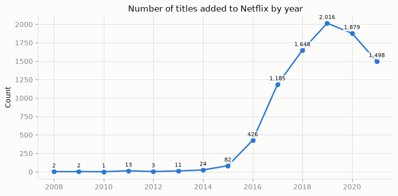
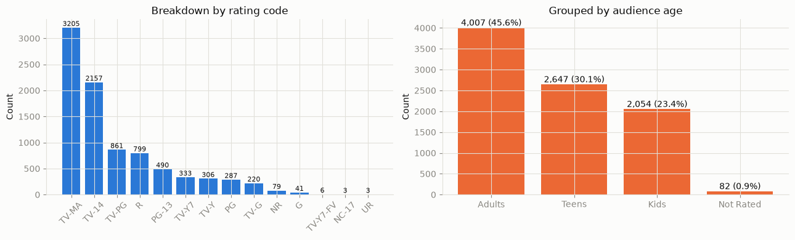
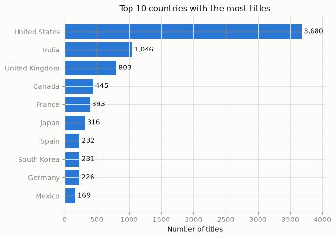

# Netflix Content Catalog Analysis

Data cleaning and exploratory data analysis (EDA) of 8,800+ Netflix titles to understand how Netflix builds its content catalog **over time, by audience, by genre and by region**, and what that suggests for its content strategy.

**Tools:** Python (Pandas, NumPy, Matplotlib, Seaborn, WordCloud) · Jupyter Notebook

## Key findings

**1. The catalog was built almost entirely from 2016 onwards.** 2016–2021 accounts for 98.4% of all titles, peaking at 2,016 titles in 2019. The 2021 drop is a data artefact: data stops in September, and the monthly pace (~166 titles/month) was close to the 2019 peak (168).



**2. Content is aimed at mature audiences.** TV-MA (36%) and TV-14 (25%) are the most common ratings. Adults content makes up 45.6% of the catalog, while content for young children (TV-Y, TV-G, G) is only 6.5%.



**3. The US leads, but India and Asia are rising.** The US accounts for 46.2% of titles with country information, 3.5× the runner-up. India ranks 2nd (13.1%), ahead of the UK, and the top 10 includes 3 Asian countries (India, Japan, South Korea).



**4. Other findings**
- **Movies dominate:** 69.7% of titles (6,126), about 2.3× the number of TV Shows. About 2/3 of TV Shows have only 1 season.
- **No clear seasonality:** each genre's monthly share stays within ~5–11% around the even 8.3% baseline.
- **Top directors reflect format, not popularity:** most of the top 10 make stand-up comedy specials or Indian children's animation, short formats that are easy to produce in volume.
- **Descriptions sell people and emotions:** the most common keywords revolve around family, love, youth and a character's journey.

## Recommendations

- **Consider expanding content for young children** (only 6.5% of the catalog), after checking it against the share of accounts with kids' profiles.
- **Keep investing in Asian content.** India, Japan and South Korea are already in the top 10; analyse their year-by-year growth to confirm the trend.
- **Review the series renewal strategy.** Most series stop after 1 season; combine with viewership data to tell intentional short series from cancellations.
- **Use low-cost formats** such as stand-up comedy and short animation to grow the catalog, as long as viewer performance justifies it.
- **Plan releases around marketing campaigns rather than seasons**, since genres show no clear seasonality; test more family content at the end of the year.

## Analysis questions

1. Which content type (Movie/TV Show) makes up the majority?
2. How is the duration of Movies and TV Shows distributed?
3. Which rating is the most common?
4. In which year did Netflix "boom" in the number of newly added titles?
5. Which genres does Netflix add the most in each month of the year? (seasonality)
6. Who are the top 10 directors with the most titles?
7. Which country has the most titles?
8. What are the most common keywords in the descriptions?

## Workflow

1. **Data overview:** size and data type of each column.
2. **Data cleaning**
   - Missing data: filled `director`, `cast`, `country` with "Unknown"; dropped 17 rows missing `date_added`, `rating` or `duration` (including 3 rows where the duration was entered in the `rating` column).
   - Duplicates: checked both full rows and content excluding `show_id`.
   - Format: parsed `date_added` to datetime (after stripping leading spaces); split `duration` into a number and a unit.
   - Logic checks: `date_added` vs. `release_year`.
   - Outliers: movie duration (IQR) and number of TV Show seasons, kept as real values.
   - Re-encoding: split multi-value columns (`listed_in`, `country`, `director`, `cast`); grouped the 14 rating codes into Kids / Teens / Adults following Netflix's US maturity levels.
3. **Feature engineering:** description length; year / month / day added.
4. **EDA:** one section per question: question → chart → insight.
5. **Conclusions, recommendations and data limitations.**

## Files

| File | Description |
|---|---|
| `Netflix_EDA_English.ipynb` | Full analysis notebook (English) |
| `Netflix_EDA_Vietnamese.ipynb` | Full analysis notebook (Vietnamese) |
| `netflix_titles.csv` | Raw dataset: 8,807 titles × 12 columns, titles added up to September 2021. Source: [Kaggle – Netflix Movies and TV Shows](https://www.kaggle.com/datasets/shivamb/netflix-shows) |
| `images/` | Charts used in this README |

Both notebooks contain the same code and analysis; only the language differs.

## How to run

Requires Python 3 with Jupyter.

```bash
pip install pandas numpy matplotlib seaborn wordcloud
```

Open either notebook in Jupyter or VS Code, keep `netflix_titles.csv` in the same folder, then run all cells.

## Data limitations

- Data runs only to September 2021, so 2021 figures do not cover the full year.
- `release_year` has no month, so seasonality is based on `date_added` only.
- Movies are measured in minutes and TV Shows in seasons (no episode counts), so their durations cannot be compared directly.
- ~30% of rows are missing `director` and ~9% are missing `country` (filled with "Unknown"), which may slightly skew those rankings.
- No viewership data, so the recommendations still need to be checked against audience performance.
